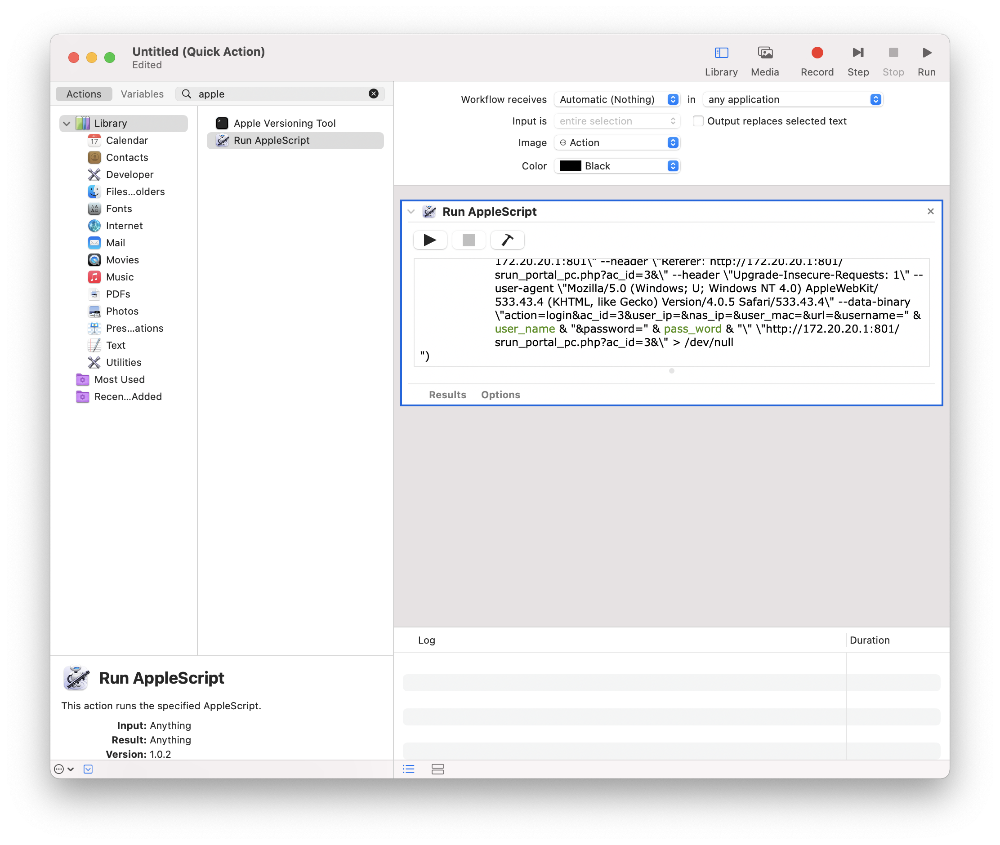

# DLUT-EDA-shell-login
DLUT-EDA Shell Login. Applicable to headless devices.

DLUT_EDA 的shell命令行客户端，适合树莓派/OPENWRT等嵌入式设备，也可以在电脑上使用简化登录过程。

## Shell Usage 脚本使用方法: 
/PATH_TO_THE_SCRIPT/dlut_eda_login.sh [-u username] [-p password] [-o]

登录方法：/PATH_TO_THE_SCRIPT/dlut_eda_login.sh -u "用户名" -p "密码"

登出方法：/PATH_TO_THE_SCRIPT/dlut_eda_login.sh -o

## AppleScript 自动切换至 DLUT-EDA 并登录

> beta version 0.4

通过 switch 脚本可以一键完成切换 DLUT-EDA 网络及登录校园网功能

### 使用方法

1. 下载脚本
2. 将 script 脚本中的 user_name 和 pass_word 修改为自己的登录信息
3. 编译并运行脚本

> 网络报错提示的图标可以自己进行选择，修改 `icon_local_path` 的值即可

### 自动化运行方案

1. 打开 Automator，新建文档并选择 Quick Action（用于添加系统快捷键，快捷更换网络）
2. 左侧搜索 Run AppleScript，将脚本内容替换为 [switch.scpt](https://github.com/Augists/dlut-eda-shell-login/blob/main/switch.scpt) 脚本中的内容，编译检查
3. 保存退出，Automator 会自动保存在 `~/Library/Services` 路径下
4. 打开系统偏好设置 System Preference，在键盘中选择 Shortcut，脚本快捷键可以在 Services 中自定义

**本脚本不会保存任何密码，请放心使用。请遵守法律法规，不要滥用脚本，否则后果自负！！！**
